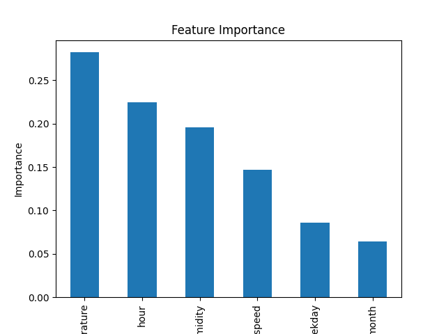

# Seoul Bike Rental Data Analysis

서울 공공자전거 대여 데이터를 활용하여 자전거 이용 패턴을 분석하고,
머신러닝 모델을 통해 자전거 대여량을 예측하는 데이터 분석 프로젝트입니다.

---

# Project Objective

본 프로젝트의 목적은 서울 공공자전거 데이터를 활용하여 다음을 분석하는 것입니다.

* 시간대 및 요일에 따른 자전거 이용 패턴 분석
* 날씨 요소(온도, 습도 등)가 이용량에 미치는 영향 분석
* 머신러닝 모델을 활용한 자전거 대여량 예측

이를 통해 공공자전거 이용 패턴을 이해하고 데이터 기반 의사결정에 활용할 수 있는 인사이트를 도출하는 것을 목표로 합니다.

---

# Dataset

서울 공공자전거 대여 데이터와 날씨 데이터를 활용했습니다.

주요 변수

* datetime : 날짜 및 시간
* temperature : 기온
* humidity : 습도
* windspeed : 풍속
* weekday : 요일
* count : 자전거 대여량

---

# Project Structure

```
bike-analysis-project
│
├── data
│   └── seoul_bike_data.csv
│
├── images
│   ├── monthly_usage.png
│   ├── hourly_usage.png
│   ├── weekday_usage.png
│   ├── temp_usage.png
│   ├── humidity_usage.png
│   ├── correlation_heatmap.png
│   └── feature_importance.png
│
├── bike_analysis.ipynb
│
└── README.md
```

---

# Analysis Process

프로젝트는 다음과 같은 순서로 진행되었습니다.

1. 데이터 불러오기 및 전처리
2. 탐색적 데이터 분석 (EDA)
3. 데이터 시각화 분석
4. 변수 간 상관관계 분석
5. 머신러닝 모델을 활용한 예측
6. 모델 성능 평가

---

# Data Visualization

## Monthly Bike Usage


월별 자전거 이용량을 분석하여 계절에 따른 이용 패턴을 확인했습니다.

---

## Hourly Bike Usage


시간대별 이용량을 분석하여 특정 시간대에 이용이 집중되는 패턴을 확인했습니다.

---

## Weekday Bike Usage


요일별 자전거 이용량을 분석하여 요일에 따른 이용 패턴 차이를 확인했습니다.

---

## Temperature vs Bike Usage


기온과 자전거 이용량 사이의 관계를 분석했습니다.

---

## Humidity vs Bike Usage


습도와 자전거 이용량 사이의 관계를 시각화했습니다.

---

## Correlation Heatmap


데이터 변수 간 상관관계를 확인하기 위해 히트맵을 생성했습니다.

---

# Machine Learning Model

자전거 대여량 예측을 위해 RandomForestRegressor 모델을 사용했습니다.

Random Forest는 여러 개의 의사결정 트리를 기반으로 예측을 수행하는 앙상블 모델로
비선형 관계를 학습하는 데 강점이 있습니다.

모델 학습 과정

* Train / Test 데이터 분리
* RandomForest 모델 학습
* 테스트 데이터 예측
* 모델 성능 평가

---

# Model Evaluation

모델 성능 평가는 MAE(Mean Absolute Error)를 사용했습니다.

MAE는 실제 값과 예측 값 사이의 평균 절대 오차를 의미하며
값이 작을수록 모델의 예측 성능이 좋음을 의미합니다.

---

# Feature Importance



RandomForest 모델을 활용하여 자전거 대여량 예측에 영향을 미치는 주요 변수를 분석했습니다.

---

# Key Insights

본 분석을 통해 다음과 같은 인사이트를 확인할 수 있었습니다.

* 특정 시간대에 자전거 이용량이 집중되는 경향이 나타났습니다.
* 온도가 적절한 범위일 때 자전거 이용량이 증가하는 경향이 있었습니다.
* 요일에 따라 자전거 이용량 차이가 존재했습니다.

---

# Tech Stack

* Python
* Pandas
* Matplotlib
* Scikit-learn

---

# Author

Seojihyun
