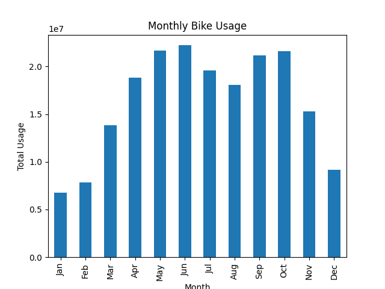
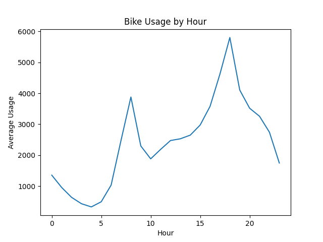
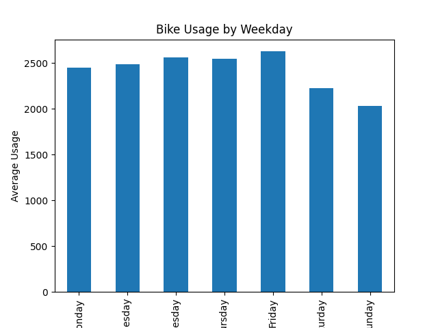
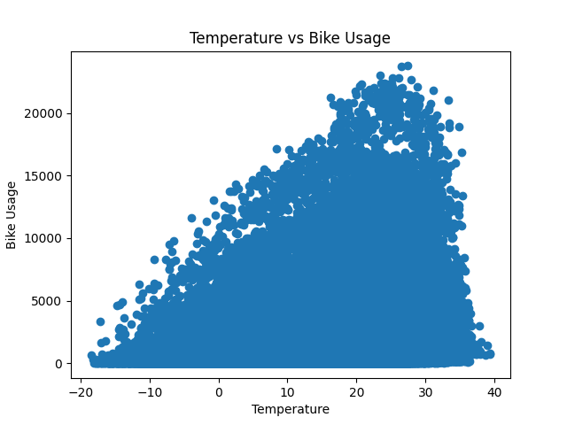
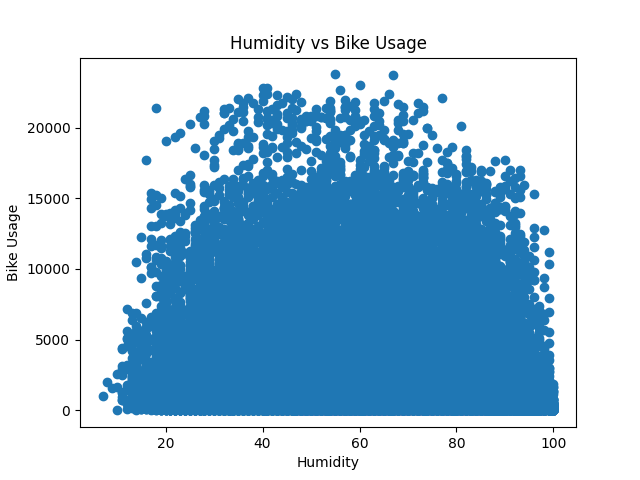
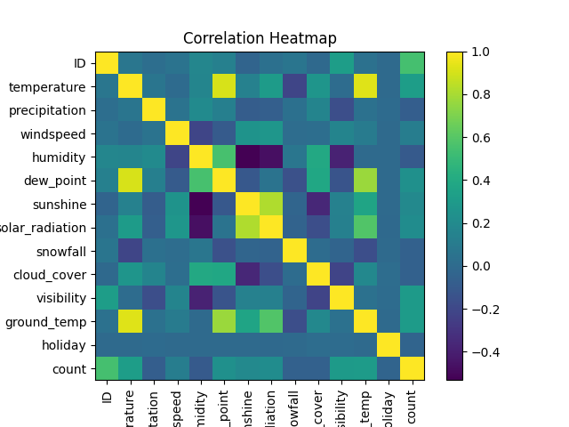

# Seoul Bike Usage Data Analysis 

Python을 활용하여 서울 공공자전거 데이터를 분석하고
시간, 요일, 날씨 요인이 자전거 이용량에 어떤 영향을 미치는지 탐색적으로 분석한 프로젝트입니다.

---

# Project Overview

본 프로젝트에서는 서울 공공자전거 대여 데이터를 활용하여
자전거 이용 패턴을 데이터 분석을 통해 파악하는 것을 목표로 합니다.

특히 다음과 같은 요인들이 자전거 이용량에 어떤 영향을 미치는지 분석했습니다.

* 시간대별 이용 패턴
* 요일별 이용 패턴
* 기온과 이용량의 관계
* 습도와 이용량의 관계
* 변수 간 상관관계

---

# Tools

* Python
* Pandas
* Matplotlib

---

# Dataset

서울 공공자전거 대여 데이터와 기상 데이터를 활용했습니다.

주요 변수

* **datetime** : 날짜 및 시간
* **temperature** : 기온
* **humidity** : 습도
* **weekday** : 요일
* **count** : 자전거 대여 수

---

# Analysis

다음과 같은 분석을 수행했습니다.

1. 월별 자전거 이용량 분석
2. 시간대별 자전거 이용량 분석
3. 요일별 자전거 이용량 분석
4. 기온과 이용량 관계 분석
5. 습도와 이용량 관계 분석
6. 변수 간 상관관계 분석

---

# Visualization

## Monthly Bike Usage



## Hourly Bike Usage



## Bike Usage by Weekday



## Temperature vs Bike Usage



## Humidity vs Bike Usage



## Correlation Heatmap



---

# Key Findings

분석 결과 다음과 같은 패턴을 확인할 수 있었습니다.

* 자전거 이용량은 **출퇴근 시간대에 증가하는 경향**을 보였습니다.
* **평일 이용량이 주말보다 높은 경향**이 나타났습니다.
* **기온이 높을수록 자전거 이용량이 증가하는 경향**이 나타났습니다.
* **습도가 높은 경우 자전거 이용량이 다소 감소하는 경향**을 보였습니다.
* 날씨 변수와 자전거 이용량 사이에는 일정 수준의 **상관관계**가 존재했습니다.

이러한 결과를 통해 시간 요인과 날씨 요인이
공공 자전거 이용 패턴에 영향을 미친다는 것을 확인할 수 있었습니다.

---

# Project Structure

```
seoul-bike-data-analysis-portfolio

├ data
│ └ Seoul_public_bike_data.csv

├ images
│ ├ monthly_usage.png
│ ├ hourly_usage.png
│ ├ weekday_usage.png
│ ├ temperature_usage.png
│ ├ humidity_usage.png
│ └ correlation_heatmap.png

├ notebook
│ └ bike_analysis.ipynb

└ README.md
```
---

# Author

Python을 활용한 데이터 분석 포트폴리오 프로젝트
